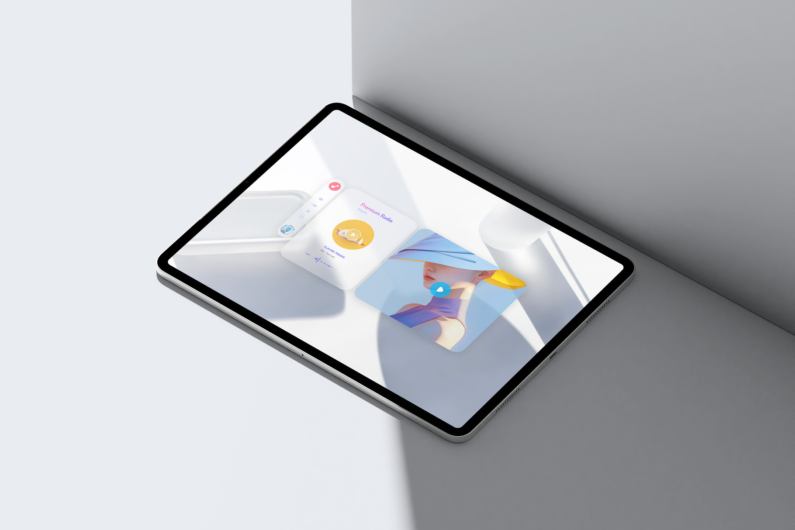

#    

### [Cafe 25](https://cafe25.vercel.app/) is a PWA radio app + FLAC streaming.   

Café 25 is a minimalist web-based radio player designed with a calm, editorial aesthetic.
It streams high-quality digital radio while focusing on simplicity, atmosphere, and smooth interaction.     

   

✨ Features   

Live FLAC Radio Streaming   
High-quality audio stream with instant playback.   

Custom Audio Controls   
Play / stop toggle with animated waveform feedback.   

Live Track Information   
Fetches and displays current artist and track title via a remote radio API.   

Minimal Editorial UI   
Clean layout inspired by magazine and café culture aesthetics.   

Responsive Design   
Optimized for desktop and mobile viewports.   

Lightweight & Fast   
No frameworks, no build tools — pure vanilla stack.   

Cross-Origin Streaming Support   
Handles external audio streams safely.   

Smooth Loader Transition   
Subtle loading animation on page load.   

Progressive Web App Ready   
Includes icons and structure prepared for PWA installation.   