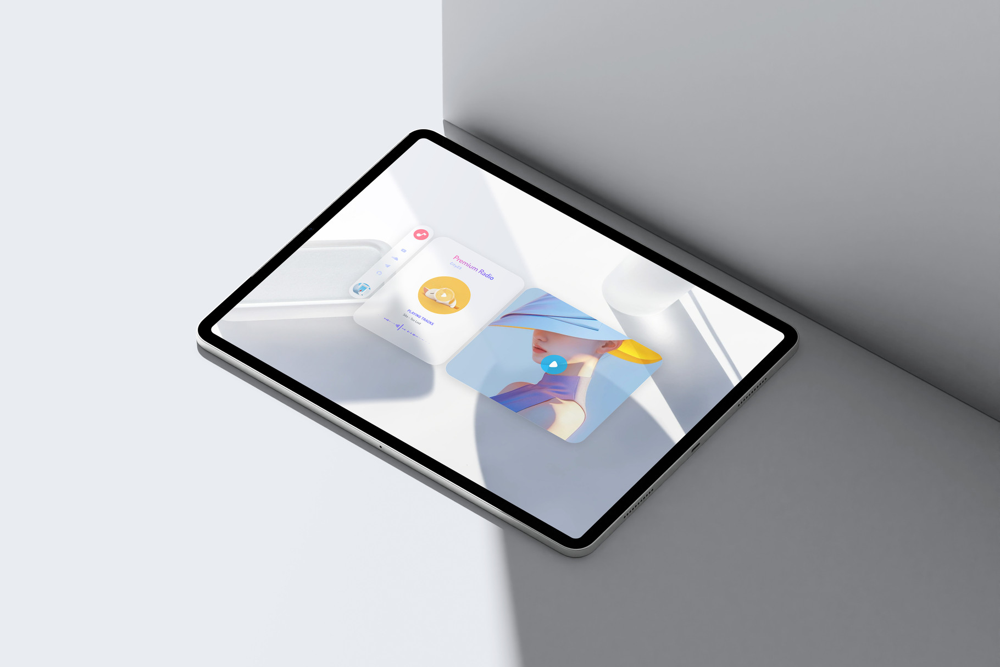

   

### [Cafe25](https://cafe25.vercel.app/) is a premium Vien city23 radio.     
  
- Installing PWA radio player
- Youtube video show
- Responsive    
- Tailwind v4   
- Vanilla JS  
- Live audio visualizer    

#### Cafe25 is a PWA radio app.

Cafe25 is a minimal, premium online radio player focused on chillout, lounge, pop, and disco sounds and streams music 24/7 via a lightweight, vanilla player.

#### Features

- Play / Pause radio stream   
- Volume control with default preset   
- Live streaming audio   
- Current track information display   
- Real-time audio visualizer (Web Audio API)   
- Optional YouTube video background   
- Responsive mobile-friendly design   
- Lightweight – no frameworks required   
- Simple static hosting (GitHub Pages / Vercel / Netlify)  

#### Audio Visualizer   

The player uses the Web Audio API to analyze the audio stream and render a waveform visualizer.  

#### Track Metadata   

The player periodically requests current song information from a song service endpoint.   

#### Deployment   

This project works with any static hosting:   

GitHub Pages   
Vercel   
Netlify   
Cloudflare Pages      

#### License   
Free to use and modify for personal or commercial projects.   